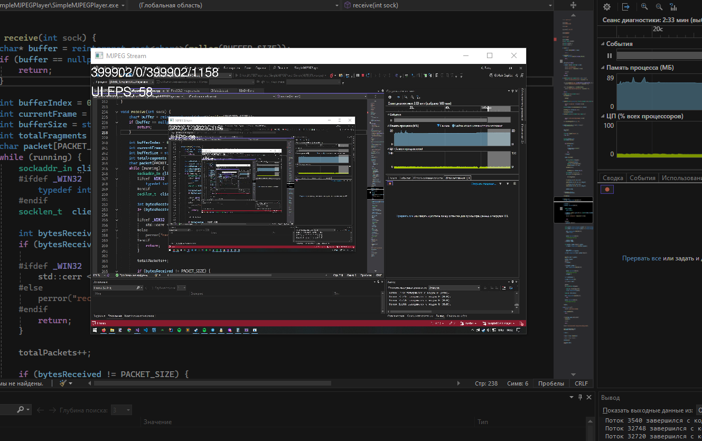

# Программа для захвата рабочего стола и стрима mjpeg потоком  

Программа захватывает изображение, сжимает в jpeg
отправляет udp пакетами на приемник
   
## Используемые библиотеки
DirectX 11 используется для быстрого захвата изображения  
Используется библиотека TurboJPEG для сжатия кадров
    
Пример приемника кадров и их возпроизведения есть в другом моём [репозитории](https://github.com/D3Hades/SimpleMJPEGPlayer)

## Пример работы:  

## Использование
Программа запускается и сразу начинает работать  
Адрес и порт для пакетов указывается в коде.

### Структура пакета

<table>
	<tbody>
		<tr>
			<td>Биты</td>
			<td>0 - 15</td>
			<td>16-23</td>
			<td>24-31</td>
		</tr>
		<tr>
			<td>0-31</td>
			<td>Размер полезной нагрузки</td>
			<td colspan="2">Номер кадра</td>
		</tr>
		<tr>
			<td>32-63</td>
			<td>Номер пакета в кадре</td>
			<td>Флаг последнего пакета кадра</td>
			<td>Полезная нагрузка</td>
		</tr>
		<tr>
			<td>64-...</td>
			<td colspan="3">Полезная нагрузка</td>
		</tr>
	</tbody>
</table>